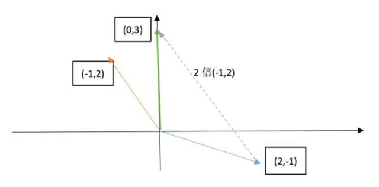

# Lecture 1: The geometric interpretation of equations

This lecture is a simple intro of Linear Algebra.

Beginning with solving the system of equations, we will introduce the row picture and column picture.

##  Gemetric form of equations

suppose we have a equations:
$$
\left\{
	\begin{array}{c}
		2x - y = 0 \\
		-x + 2y = 3
	\end{array}
\right.
$$

### row picture

we can extract the unknows and coefficients tp transform the equation to a matrix form like $Ax=b$:
$$
\left[
	\begin{matrix}
		2 & -1 \\
		-1 & 2
	\end{matrix}
\right]
\left[
	\begin{matrix}
		x \\
		y
	\end{matrix}
\right]
=
\left[
	\begin{matrix}
		0 \\
		3
	\end{matrix}
\right]
$$
the row picture is select one raw from the coefficient matrix and multiple with the unkonws, then we can draw a picture like this:

two unparallel line must intersect at one point((1, 2) for this equaitons), and that point is the solution of the equations.

### column picture

For columu picture, we just extract the coefficients:
$$
x
\left[
	\begin{matrix}
		2 \\
		-1
	\end{matrix}
\right]
+
y
\left[
	\begin{matrix}
		-1 \\
		2
	\end{matrix}
\right]
=
\left[
	\begin{matrix}
		0 \\
		3
	\end{matrix}
\right]
$$
now the problem becomes:  find out the right linear combination of the column vectors to get $\left[\begin{matrix}0 \\ 3\end{matrix}\right]$.

And the column picture is like this:

**Notes: for this equations, all the $\left[\begin{matrix}x \\ y\end{matrix}\right]$ could give out all the `b`, which means it could full-fill the 2-dimension plane.**

## Extension

Now we look at the 3x3 example(3 unknows and 3 equations):
$$
\left\{
	\begin{array}{c}
		2x - y = 0 \\
		-x + 2y - z = -1 \\
        -3y + 4z = 4
	\end{array}
\right.
$$
we can extract a $Ax=b$ like this:
$$
\left[
	\begin{matrix}
		2 & -1 & 0 \\
		-1 & 2 & -1 \\
		- & -3 & 4
	\end{matrix}
\right]
\left[
	\begin{matrix}
		x \\
		y \\
		z
	\end{matrix}
\right]
=
\left[
	\begin{matrix}
		0 \\
		-1 \\
		4
	\end{matrix}
\right]
$$
Its row picture is in 3-dimension coordinate, each equation is a 2-dimension plane.

For this system of euqations, we can roughly reckon that these three plane intersect at one point. But as the number of unknow increase(extense to a higher dimension), row picture become more abstract for us, because we can draw out its picture.

If we use column picture:
$$
x
\left[
	\begin{matrix}
		2 \\
		-1 \\
		0
	\end{matrix}
\right]
+ y
\left[
	\begin{matrix}
		-1 \\
		-2 \\
		-3
	\end{matrix}
\right]
+ z
\left[
	\begin{matrix}
		0 \\
		-1 \\
		4
	\end{matrix}
\right]
=
\left[
	\begin{matrix}
		0 \\
		-1 \\
		4
	\end{matrix}
\right]
$$

on the left size is the combination of the column vectors of matrix $A$, and right hand side is the result, then the problem still is a linear combination case. And the solution for this example is quiet simple: $\left[\begin{matrix}0\\0\\1\end{matrix}\right]$.

### Why column picture

Comparing with the row picture, column pictrure is a more systematic way to solve the equations: to find out a linear combination.

Besides, if we change the vector $b$, for column picture case,  we just need to find another combination, but for row picture, we need draw another 3-dimension picture.

## The solution of Ax=b

Does $Ax=b$ always have a solution for evert given vector `b`?

In $\mathbb{R}^3$ case, `b` is a 3-dimension vector, and all the `b` fill the $\mathbb{R}^3$, so the problem become:

**do all the linear combinations of the columns fill the 3-dimension space.**

In other word, if $Ax=b$ have solution, $b$ must be the linear combination of $A's$ columns.

## Matrix multiplication

For a given matrix $A=\left[\begin{matrix}2 & 5\\ 1 & 3 \end{matrix}\right]$ and vector $x=\left[\begin{matrix}1 \\ 2\end{matrix}\right]$, how we compute their multiple?

- use column

$x$ means the linear combinatin of $A$, every componet of $x$ multiple the correspondind column vector of $A$:
$$
1\cdot
\left[
	\begin{matrix}
		2 \\
		1
	\end{matrix}
\right]
+
2\cdot
\left[
	\begin{matrix}
		51 \\
		3
	\end{matrix}
\right]
=
\left[
	\begin{matrix}
		12 \\
		7
	\end{matrix}
\right]
$$

- use row: normal way.