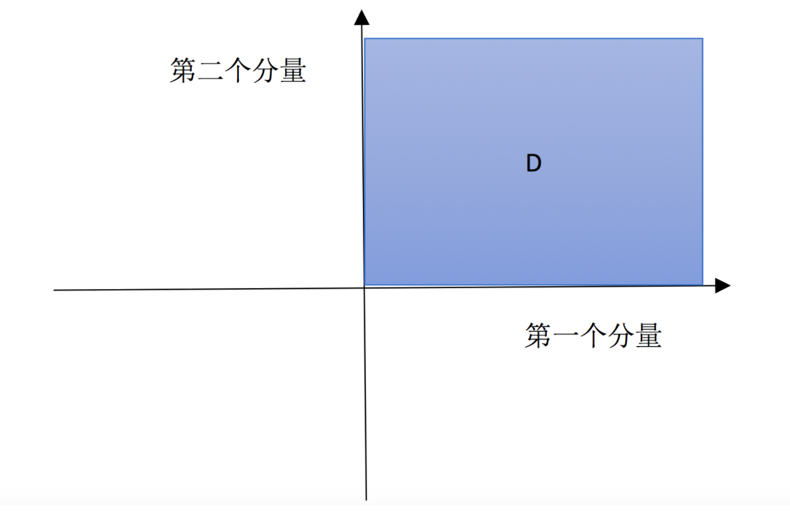
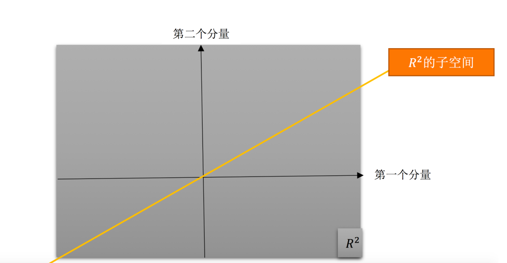

# Lecture 5: transpose, permutation, vector space

[toc]

## Permutation matrix

Permutation matrix P: to execute row exchange.

For a good matrix $A$: inversible and no-zero on the pivot column, always satisfy the equation $A=LU$.

But not all the matrix are good so we need permutation matrix to finish row exchange and for any inversible matrix always have $PA=LU$.

## Transpose

$$
(A^T)_{ij}=(A)_{ji}
$$

If $A^T=A$, the $A$ is a symmetric matrix.

- $R^TR$ always a symmetric matrix: $(R^TR)^T=R%TR$.

## Vector space

### vector space

So-called vector space satisfied that closed with linear operation:

- addition:$\forall v,w \in\mathbb{R^n},\ (v+w) \in \mathbb{R^n}$.
- multiply by a real number: $\forall v \in \mathbb{R^n},n \in R,\ n\cdot v \in \mathbb{R^n}$.
- any vector space has to include $\boldsymbol{0}$ vector.

### Example: From $\mathbb{R^2}$ extend to​ $\mathbb{R^n}$

In lower dimension, we can describe the vector space with diagram, such as $\mathbb{R^2}$ is a plane and $\mathbb{R^3}$ is a 3D space people lived and we can draw column picture of them.

When it extend to n-dimension, and $n \to \infty$, it's hard to describe the vector space and the intuitional understanding is $\mathbb{R^n}$ include all n-dimension vector and every vector have n real components.

### subspace

**Consider:** if we select a part of a vector space, will it construct a vector space?

**Answer:** it depends on whether it still satisfy the condition, some will be and some may not.

**Example:** $\mathbb{R^2}$

1. select the first quadrant as a sub-space $\mathbb{D}$

   It's obviously that if we multiply the vector in $\mathbb{D}$ with a negative, the result will in third quadrant rather than first quadrant, so sub-space $\mathbb{D}$ is not a subspace.

   

2. a line cross the original point: is a subspace of $\mathbb{R^2}$

   

**Conclusion:** 

​	subspace for $\mathbb{R^2}$: $\mathbb{R^2}$, line across origin, $\vec{0}$.

​	subspace for $\mathbb{R^3}$: $\mathbb{R^3}$, plane across origin, line across origin, $\vec{0}$

## Column space

Given a matrix $A=\left[\begin{matrix}1&3\\ 2&3\\ 4&1\end{matrix}\right]$, how to build a subspace with it?

Look at the column vector, they all in $\mathbb{R^3}$, to satisfy the linear closed operation, a intuitional understanding is all its linear combinations form a subspace we called **column space** and denote as $C(A)$.

